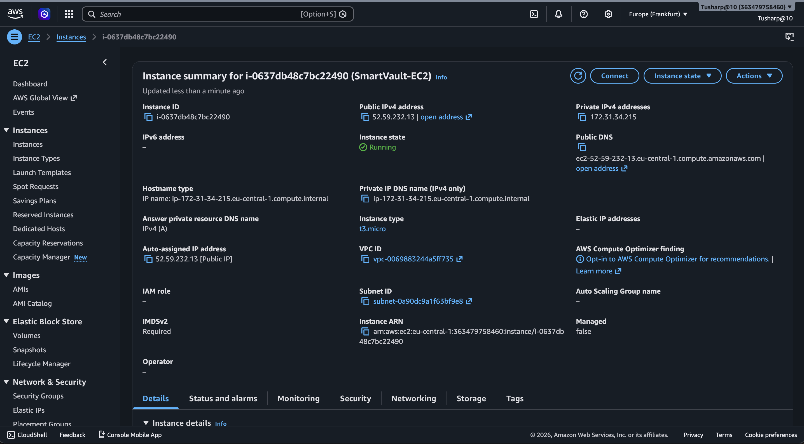
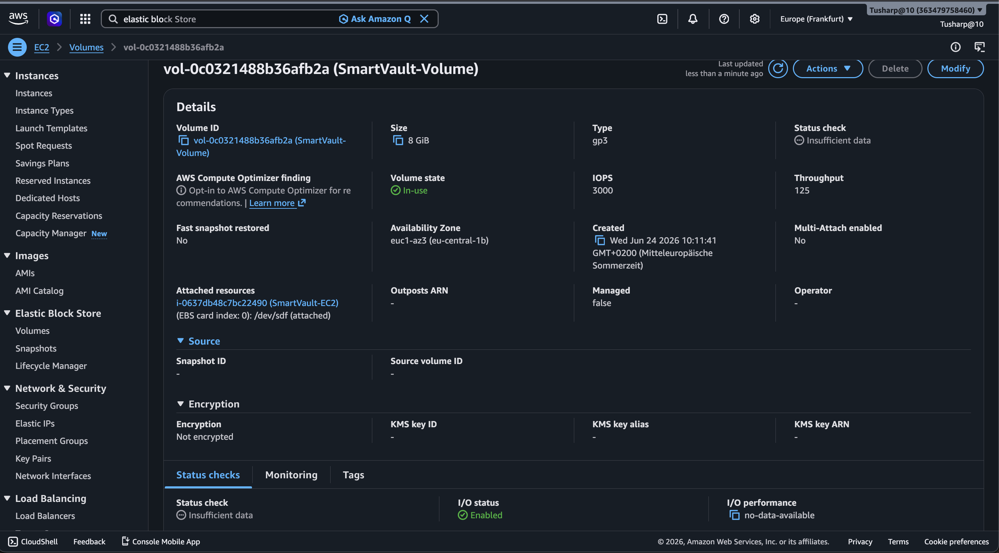
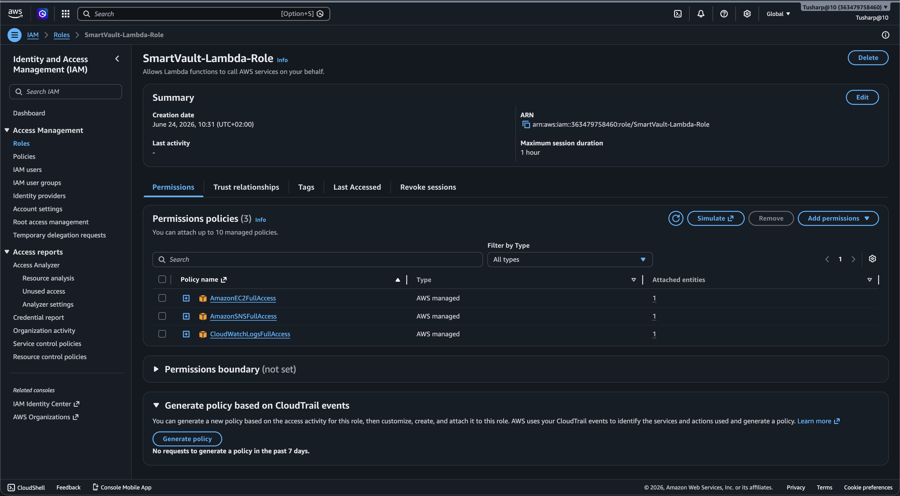
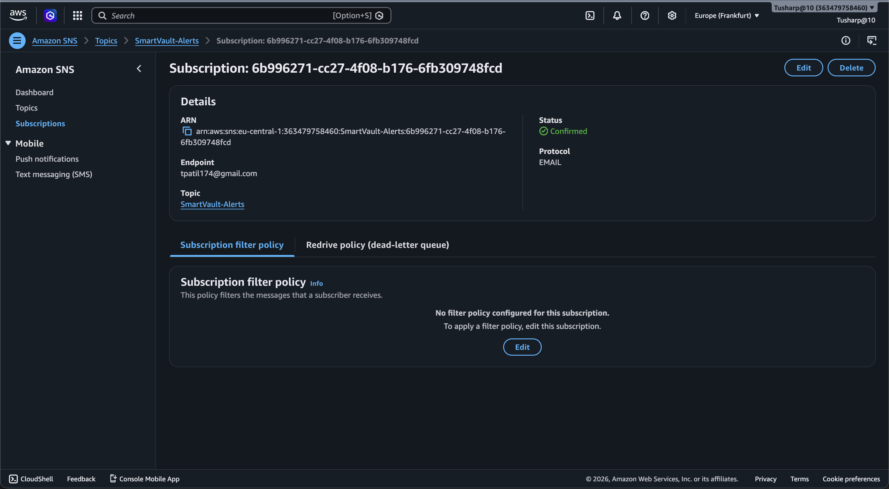
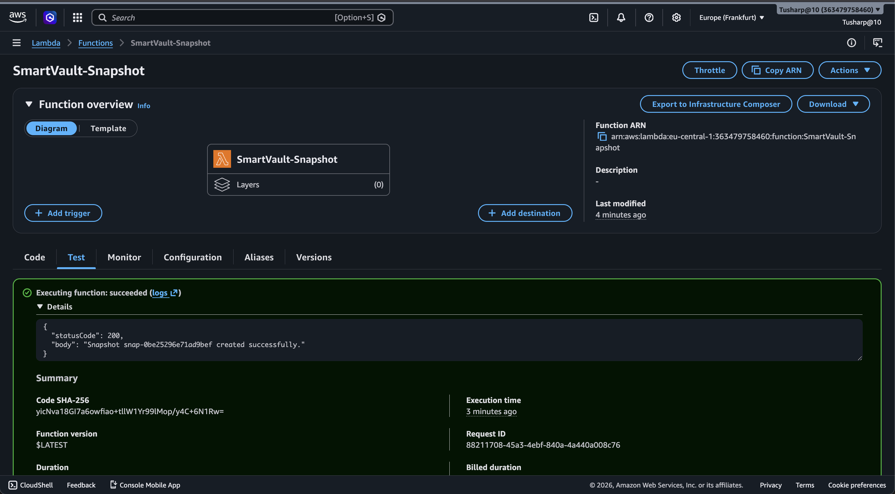
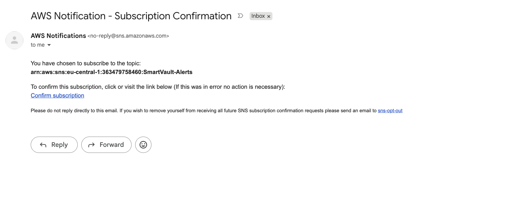
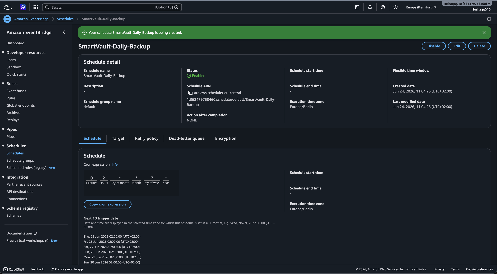

# SmartVault-AWS 🔐

> Production-style automated backup system demonstrating real-world cloud automation, serverless architecture, and alerting workflows using AWS.

SmartVault is a **serverless, automated EBS snapshot backup system** built entirely on AWS.
It creates daily backups of EC2 EBS volumes automatically, monitors execution via CloudWatch,
and notifies the owner instantly on success or failure via **SNS email alerts** — no manual
intervention required.

---

## 🎯 Why This Project

This project simulates a real-world DevOps backup automation scenario where:

- Critical data needs to be backed up on a schedule
- Operations teams need instant alerts on backup status
- Everything runs serverlessly — no servers to manage
- Security follows least-privilege IAM principles

It demonstrates practical skills in:
- Cloud automation and serverless architecture
- Infrastructure monitoring and alerting
- IAM security and least-privilege design
- Python scripting for AWS operations
- Scheduling and event-driven workflows

---

## Architecture

EventBridge (Daily Cron: 0 2 * * ? *)

│

▼

AWS Lambda (Python 3.12 — Snapshot Core)

├── Amazon EC2 API    →  Creates EBS snapshot

├── Amazon SNS        →  Email alert (success or failure)

└── CloudWatch Logs   →  Execution logs and monitoring

│

▼

Admin Email (SmartVault-Alerts → tpatil174@gmail.com)

---

## Key Features

| Feature | Basic approach | SmartVault implementation |
|---|---|---|
| Backup trigger | Manual | Fully automated via EventBridge cron |
| Failure handling | None | Try/except with SNS failure alert |
| Notifications | None | SNS email on both success and failure |
| Snapshot description | None | Timestamped description per snapshot |
| Logging | None | CloudWatch Logs for every execution |
| IAM security | Admin access | Least-privilege role (snapshot + SNS only) |
| Schedule | Manual | Daily at 2:00 AM UTC |

---

## 🧩 Skills Demonstrated

- Cloud Infrastructure Automation (AWS)
- Serverless Architecture Design
- Python Scripting (boto3)
- IAM Role and Policy Management
- Event-Driven Scheduling (EventBridge)
- Monitoring and Alerting (CloudWatch + SNS)
- Backup and Disaster Recovery Concepts

---

## AWS Services Used

| Service | Purpose |
|---|---|
| AWS Lambda | Core backup logic in Python 3.12 |
| Amazon EC2 | Source instance with attached EBS volume |
| Amazon EBS | Volume that gets snapshotted daily |
| Amazon SNS | Email alerts on success or failure |
| Amazon EventBridge | Triggers Lambda on daily cron schedule |
| Amazon CloudWatch | Logs Lambda output and errors |
| AWS IAM | Least-privilege execution role for Lambda |

---

## 🧪 Example Real Scenario

**Scheduled trigger fires at 2:00 AM UTC**

System behavior:
- EventBridge triggers Lambda automatically
- Lambda connects to EC2 and creates EBS snapshot
- Snapshot is tagged with timestamp in description
- SNS sends success email to admin with snapshot ID
- CloudWatch logs full execution details

This mirrors real DevOps backup automation workflows.

---

## How It Works

1. **EventBridge** fires the cron trigger daily at 2:00 AM UTC
2. **Lambda** is invoked and connects to EC2 via boto3
3. Lambda creates a **snapshot** of the specified EBS volume with a timestamped description
4. On success → **SNS** publishes an email with snapshot ID, volume ID, and timestamp
5. On failure → **SNS** publishes a failure alert with the error details
6. All execution output is logged to **CloudWatch Logs**

---

## Email Notification Example

**Subject:** `SmartVault - Snapshot Created Successfully`

**Body:**

Snapshot snap-0be25296e71ad9bef created successfully

for volume vol-0c0321488b36afb2a

at 2026-06-24 08:53:59 UTC.


---

## Setup Guide

### 1. Launch EC2 Instance

- AMI: Amazon Linux 2023
- Instance type: t3.micro
- Name: `SmartVault-EC2`

### 2. Create and Attach EBS Volume

- Type: gp3, Size: 8 GB
- Availability Zone: must match EC2
- Name tag: `SmartVault-Volume`
- Attach to EC2 at `/dev/sdf`

### 3. IAM Role for Lambda

Create role `SmartVault-Lambda-Role` with these policies:

```json
{
  "Effect": "Allow",
  "Action": [
    "ec2:CreateSnapshot",
    "ec2:DescribeSnapshots",
    "sns:Publish",
    "logs:CreateLogGroup",
    "logs:CreateLogStream",
    "logs:PutLogEvents"
  ],
  "Resource": "*"
}
```

### 4. SNS Topic

- Create Standard topic: `SmartVault-Alerts`
- Subscribe your email address
- Confirm subscription from inbox

### 5. Deploy Lambda

- Runtime: Python 3.12
- Function name: `SmartVault-Snapshot`
- Execution role: `SmartVault-Lambda-Role`
- Timeout: 30 seconds
- Paste `lambda_function.py` code and Deploy

### 6. EventBridge Schedule

- Name: `SmartVault-Daily-Backup`
- Cron: `0 2 * * ? *` (daily at 2:00 AM UTC)
- Target: Lambda → `SmartVault-Snapshot`
- Flexible time window: Off

---

## ✅ Live Test Result

- **Snapshot ID:** `snap-0be25296e71ad9bef`
- **Volume:** `vol-0c0321488b36afb2a` (SmartVault-Volume)
- **Status:** Completed ✅
- **Progress:** 100% ✅
- **Email notification:** Received ✅
- **CloudWatch logs:** Active ✅

---

## Project Structure


SmartVault-AWS/

│

├── lambda_function.py       # Core Lambda function (Python 3.12)

└── README.md                # Project documentation


---

## Future Improvements

- [ ] Automatic deletion of snapshots older than 30 days
- [ ] Slack notification integration
- [ ] Multi-volume backup support
- [ ] Terraform IaC deployment
- [ ] SNS → Lambda → S3 snapshot inventory log
- [ ] CloudWatch dashboard for backup history

---

## Cost Estimate (AWS Free Tier)

| Service | Free tier | Typical usage |
|---|---|---|
| Lambda | 1M requests/month | ~$0 |
| EBS Snapshots | 1 GB/month free | minimal cost |
| SNS | 1000 emails/month | ~$0 |
| EventBridge | 14M events/month | ~$0 |
| CloudWatch | 5 GB logs/month | ~$0 |

**Total: effectively $0 on free tier.**

## 📸 Screenshots

### EC2 Instance Running


### EBS Volume Attached


### IAM Role Created


### SNS Subscription Confirmed


### Lambda Test Success


### SNS Email Received


### EventBridge Schedule


---

## Author

**Tushar Patil**  
IT Professional · Cloud & DevOps Enthusiast · Stuttgart, Germany  
[LinkedIn](https://linkedin.com/in/tusharpatil174) · [GitHub](https://github.com/tpatil174)


